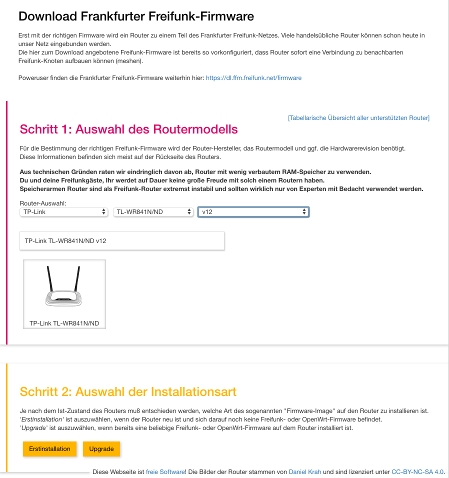

OpenWrt/LEDE Firmware Wizard
---

Dieses Projekt ist ein Fork vom [Darmstädter OpenWrt/LEDE Firmware Selector](https://github.com/freifunk-darmstadt/gluon-firmware-selector).

Auf Grund unserer Lokalisierungen driftet das Projekt ganz leicht von dem Darmstädter Repo weg.

Der Frankfurter Firmware Selector ist hier zu finden: https://ffm.freifunk.net/firmware

--- 

This Firmware Wizard lets a user select the correct firmware for his device. Directory listings are used to parse the list of available images.

### Screenshot

### License
This program is free software: you can redistribute it and/or modify
it under the terms of the GNU Affero General Public License as published by
the Free Software Foundation, either version 3 of the License, or
(at your option) any later version.
